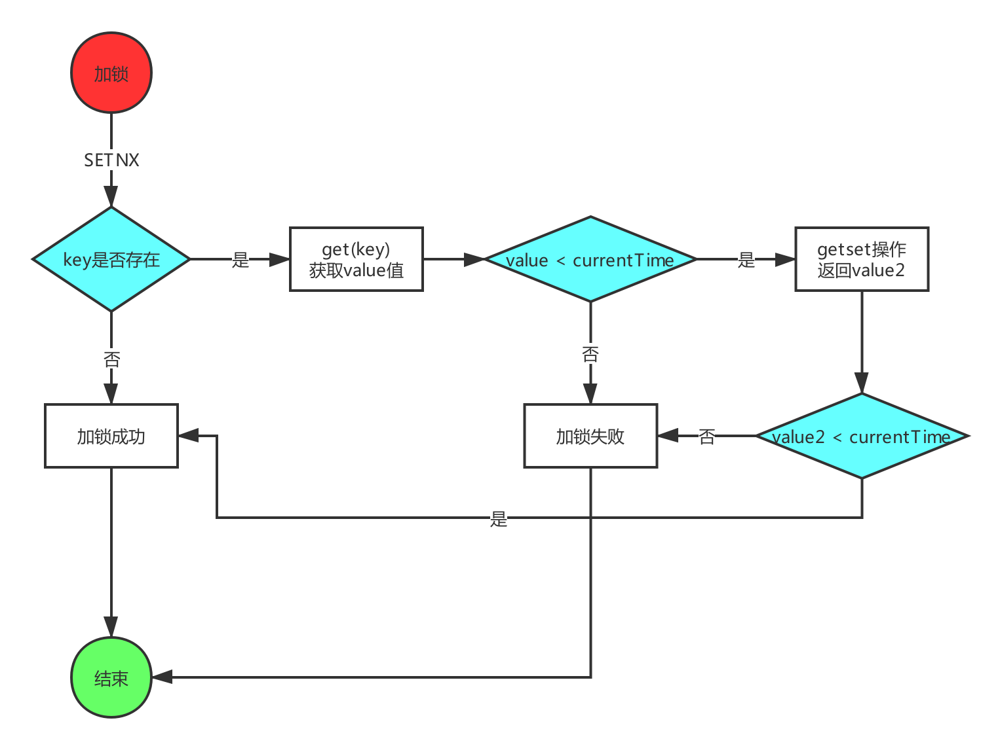

## 背景描述
业务系统网关（API）接口，负责处理客户端发送的 HTTP 请求数据，对于某些客户端的请求数据，需要控制请求的频率；在上一个请求处理完之前，接收到的下一个请求需要拒绝掉，例如，签到领礼品接口，请求到达服务端，需要发放奖品，记录日志，如果逻辑还没处理完，还没成功保存日志数据，客户端又发送了一次请求，查询日志未领取奖品，会导致重复发放奖品。

PS. 举例逻辑可能比较简单，有些人会较真说需要客户端控制按钮是否可点击（有可能有恶意用户使用 HTTP 客户端工具请求接口），我们只是举例说明一下，主要是写数据场景，防止两次接口请求时间过短导致的重复写数据。

<!-- more -->

## 业务实现
对于这种业务场景，基本可以马上想到使用`锁`来满足需求；不过目前互联网业务系统基本都是分布式部署，分布式部署肯定不能使用 JDK 自带的锁来实现了，一般要使用分布式锁。
当前业务系统中是使用 Redis 的 set 命令实现的分布式锁，主要实现逻辑如下：
> 加锁：
> SET key value time NX
> key: 加锁 key 值
> value：设置 value，可以设为1
> time：设置 key 的过期时间
> NX ：只在 key 不存在时，才对 key 进行操作
> 解锁：
> 1、超时后自动删除 key，解锁，无须程序解锁
> 2、程序解锁：DEL key

业务系统使用场景（伪代码实现）：
```java
String key = "SIGN_GET_GIFT_" + userId;
boolean lock = SET key true 5 NX;
if (!lock) {
    return "签到失败，请勿频繁请求";
}
//执行签到领取礼品逻辑
signGetGift();
saveSignLog();
del(key);
return "签到成功";
```
这就是系统通过 Redis 实现的分布式锁，至于这个实现的优点、缺点，是否存在不足或者在某些场景下是否会引起问题，我们后面分析，下面我们来列举一下使用 Redis 实现分布式锁的几种方式。

## setnx() & expire()实现分布式锁
setnx 是 `SET if Not exists`（如果不存在，则 SET）的简写。使用方式为 setnx(key, value)。该方法是原子的，如果 key 不存在，则设置当前 key 成功，返回 1；如果当前 key 已经存在，则设置当前 key 失败，返回 0。

由于 setnx 无法设置过期时间，一旦加锁后就必须显示操作删除 key，释放锁资源，否则会产生死锁；所以需要使用 `expire` 命令设置 key 过期时间，这样可以在超时后自动释放锁资源，防止出现死锁，`expire` 命令使用方式为 `expire(key, time)`。

实现步骤：
- setnx(key, 1) 如果返回 0，则说明加锁失败；如果返回 1，则说明加锁成功；
- expire(key, 10)，对 key 设置超时时间，超时自动释放锁资源，避免出现死锁问题；
- 执行完业务代码后，可以通过 del 命令删除 key，显示释放锁资源。

```java
// 伪代码
String key = "SIGN_GET_GIFT_" + userId;
boolean lock = SETNX key 1;
if (!lock) {
    return "签到失败，请勿频繁请求";
}
// 设置过期时间 10s
expire(key, 10);
// 执行签到领取礼品逻辑
signGetGift();
saveSignLog();
del(key);
return "签到成功";
```
主要问题：
`setnx()` 和 `expire()`是分两步执行，并不是一个原子操作，如果在第一步 `setnx()` 执行成功后，在 `expire()` 命令执行前，发生了系统崩溃，导致设置超时时间失败，锁资源无法正常释放，一定会出现死锁的问题。

## setnx() & get() & getset()实现分布式锁
该方法主要对 `setnx() & expire()` 可能存在的死锁问题做出一些改进。

`getset()` 命令的使用方式为 `getset(key, value)`，该命令将给定 key 的值设为 value，并返回 key 的旧值（old value）。

实现步骤：
- setnx(key, 当前时间 + 过期超时时间)，如果返回 1，则表示加锁成功；如果返回 0 则表示加锁失败，执行下一步；
- get(key) 获取值 key 过期时间（value1），并将这个 `过期时间` 值与当前的系统时间进行比较，如果 < 当前系统时间，则认为这个锁已经超时，可以允许其他请求执行加锁操作，转向下一步；
- 计算 value2 = 当前时间 + 过期超时时间，然后 getset(key, value2) 会返回当前 key 的值 `旧的过期时间（value3）`；
- 判断步骤二 `value3` 是否小于当前系统时间，如果小于系统时间，则说明当前 `getset` 执行成功，获取到了锁；如果大于系统时间，说明这个锁又被别的请求竞争到了，当前请求加锁失败；
- 在获取到锁之后，当前线程可以开始自己的业务处理，当处理完毕后，比较自己的处理时间和锁设置的超时时间，如果小于锁设置的超时时间，则直接执行 `del(key)` 释放锁；如果大于锁设置的超时时间，则不需进行释放锁操作。



```java
// 伪代码
boolean getLockSuccess = false;
long lockExpireTime = 0L;
String key = "SIGN_GET_GIFT_" + userId;
boolean lock = SETNX key (currentTime + 1000ms);
if (!lock) {
    long value1 = get(key);
    if (value1 < currentTime) {
        long value2 = currentTime + 1000ms;
        long value3 = getset(key, value2);
        if (value3 < currentTime) {
            getLockSuccess = true;
            lockExpireTime = values2;
        }
    }
} else {
    getLockSuccess = true;
}
if (getLockSuccess) {
    // 执行签到领取礼品逻辑
    signGetGift();
    saveSignLog();
    if (currentTime < lockExpireTime) {
        del(key);
    }
    return "签到成功";
} else {
    return "签到失败，请勿频繁请求";
}
```
使用 `setnx() & get() & getset()` 实现分布式锁最大的问题是 `判断锁失效依赖于系统时间`，如果是分布式环境，当某一台服务器时间不准确，时间慢一些，有可能在这台服务器上刚刚执行的加锁操作，在另外一台服务器上判断就已经是处于过期状态。

## SET key value time NX 实现分布式锁

使用 `SET key value time NX` 命令实现分布式锁是将 `setnx() & expire()` 两步操作合并成一步操作来保证原子性。

实现步骤：
> 加锁：
> SET key value time NX
> key: 加锁 key 值
> value：设置 value，可以设为1
> time：设置 key 的过期时间
> NX ：只在 key 不存在时，才对 key 进行操作
> 解锁：
> 1、超时后自动删除 key，解锁，无须程序解锁
> 2、程序解锁：DEL key

```java
String key = "SIGN_GET_GIFT_" + userId;
boolean lock = SET key true 5 NX;
if (!lock) {
    return "签到失败，请勿频繁请求";
}
//执行签到领取礼品逻辑
signGetGift();
saveSignLog();
del(key);
return "签到成功";
```
## Redis 锁优化
### 加锁 & 解锁顺序错乱优化
在前面提到的几种使用 Redis 命令实现的分布式锁中，在解锁时都需要注意一个问题：
- 线程 A 对 key 加锁成功，设置超时时间 10s；
- 由于某个原因线程 A 执行较慢，时间超过 10s，导致超时自动释放锁；
- 线程 B 对 key 加锁成功，设置超时时间 10s；
- 线程 A 执行成功，执行 del(key) 命令释放锁成功，此时 B 还未执行成功，且未超时；
- 线程 C 对 key 加锁成功。


这里出现的最大问题是某个线程（A）超时导致自动释放锁，另外一个线程（B）加锁成功，A 线程执行完后执行释放锁操作，会释放掉线程 B 的锁，导致加锁、解锁操作出现错乱。
解决这个问题的方式是通过给每次加锁设置不同的value值，每次解锁时判断value值与加锁时的value值是否相等来判断是否可以执行解锁操作。例如：可以在加锁时将value值设置为 `服务器IP + 当前线程的ID`，解锁时判断解锁 `服务器IP + 当前线程的ID` 与value值是否相等来决定是否可以执行解锁操作：

```java
String key = "SIGN_GET_GIFT_" + userId;
long value = IP + "_" + Thread.currentThread().getId();
boolean lock = SET key value 5 NX;
//... ... 执行业务逻辑
long value1 = IP + "_" + Thread.currentThread().getId();
if (value1 = get(key)) {
    del(key);
}
```
PS. 在这里设置设置 value 值为 `服务器IP + 当前线程的ID`，主要就是构造一个分布式环境下的唯一标识，如果只单独使用`当前线程的ID`作为 value 值，则分布式部署情况下不同机器可能会产生相同的线程ID值，当然也可以使用构造的其他内容作为 value 值。

对于最后的 `get(key) & del(key)` 操作，可以通过使用lua脚本的方式封装成一个原子操作在 Redis 中执行：

```lua
if redis.call("get", KEYS[1]) == ARGV[1] then
    return redis.call("del", KEYS[1])
else
    return 0
end

String luaScript = "if redis.call('get', KEYS[1]) == ARGV[1] then return redis.call('del', KEYS[1]) else return 0 end";

redisClient.eval(luaScript, Collections.singletonList(key), Collections.singletonList(value1));
```
### 超时导致并发执行优化
在前面的优化中我们可以解决加锁超时导致的解锁操作顺序错乱问题，但是依然会有并发执行的情况出现，例如线程 A 对 key 加锁后执行业务代码，超时后自动释放锁；此时线程 B 对 key 加锁成功，执行业务代码；我们使用分布式锁的目的就是控制代码并发执行，现在依然会有并发执行的情况出现。

对于这个问题我们可以让获取锁的线程再开启一个 `守护线程` 的方式，用来给快要过期的锁“续航”。例如：
- 线程 A 对 key 加锁成功，过期时间 10s；
- 线程 A 开始执行业务代码；
- 当执行到 8s 时，线程 A 还没有释放锁，此时守护线程执行 expire 命令为线程 A 的锁续航，例如继续续航 5s；
- 守护线程从 8s 开始，每 5s 执行一次续航，直到线程 A 执行完毕；
- 当线程 A 执行完业务代码退出时，需要显示关闭守护线程，并释放锁资源。

对于使用守护线程续航的方式，在某个线程所在系统出现崩溃时，由于守护线程和该线程在同一个JVM中，此时守护线程也会被关闭，到锁超时的时候，由于没有线程为锁续航，锁就自动释放掉了。

对于这种自动续航的方式，我们一定要注意的是业务代码一定不能出现死循环，或者说一定要在有限时间内执行完毕，因为一旦某个线程获取锁成功，但是一直无法执行完毕，守护线程会一直为锁续航，锁永远不会超时自动释放，导致出现死锁情况。

## Redis 实现分布式锁的高可用分析
### 单点 Redis 锁缺陷
如果 Redis 服务器只有一台，很明显容易出现单点故障，很难保证高可用，一旦服务器宕机，整个分布式锁功能都会不可用。 

### Redis 主从架构的分布式锁
如果一台 Redis 服务器容易出现单点故障，那么部署 Redis 主从（master / slave，一主多从）架构，还会有问题吗？
其实仔细分析还是会有问题：
- 线程 A 在 master 节点上通过 key 获取到一个锁；
- master 把这个数据同步到 slave 节点的时候宕机了（Redis 中 master 和 slave 之间同步数据机制是**异步**的）；
- 这时候其中一个 slave 节点会升级为 master 节点；
- 线程 B 通过相同的 key 去获取分布式锁，是可以成功的，因为新升级的节点上没有这个数据。

单点是不行的，主从架构也不保险，对于这个问题，Redis 的官方给出了一个 `RedLock` 的解决方案。

### `RedLock` 分布式锁解决方案

原文：[Distributed locks with Redis](https://redis.io/topics/distlock)

翻译：[用Redis构建分布式锁](http://ifeve.com/redis-lock/)

实现 `RedLock` 实现分布式锁的前提条件是：假设有 N 个 Redis master 节点，所有节点之间是相互独立，互补影响的，并且业务系统也是单纯的对这些节点进行调用：
- 获取当前时间毫秒数（t0）；
- 轮流用相同的 key 和随机值在 N 个节点上请求锁，在这一步里，客户端在每个master 上请求锁时，会有一个和总的锁释放时间相比小的多的超时时间。比如：如果锁自动释放时间是10s，那每个节点锁请求的超时时间可能是 5-50ms 的范围，这个可以防止一个客户端在某个宕掉的 master 节点上阻塞过长时间，**如果一个 master 节点不可用了，我们应该尽快尝试下一个 master 节点**；
- 客户端计算第二步中获取锁花费的时间（t1），只有客户端在大多数 master 节点上获取锁成功，而且总共消耗的时间不超过锁释放的时间，就认为是成功获取锁了；
- 如果锁获取成功了，那现在**锁自动释放时间就是最初的锁释放时间减去之前获取锁所消耗的时间（锁业务有效时间：10s - t1）**。
- 如果锁获取失败了，不管是因为获取成功的锁不超过一半（N/2 + 1）还是因为总消耗时间超过了锁释放时间，客户端都会到每个 master 节点上释放锁，即使是那些没有获取成功的锁。

### `Redisson` 工具中的 `RedLock` 实现

`Redisson` 是一个具备内存数据网格特征的 Redis Java 客户端工具。它提供了 30 多种对象类型和服务功能：Set, Multimap, SortedSet, Map, List, Queue, Deque, Semaphore, Lock, AtomicLong, Map Reduce, Publish / Subscribe, Bloom filter, Spring Cache, Tomcat, Scheduler, JCache API, Hibernate, RPC.

Redisson 对于 RedLock 的实现：
```java
Config config = new Config();
config.useSingleServer().setAddress("redis://192.168.120.0:5378").setPassword("123456").setDatabase(0);
RedissonClient client = Redisson.create(config);

Config config1 = new Config();
config1.useSingleServer().setAddress("redis://192.168.120.1:5378").setPassword("123456").setDatabase(0);
RedissonClient client1 = Redisson.create(config1);

Config config2 = new Config();
config2.useSingleServer().setAddress("redis://192.168.120.2:5378").setPassword("123456").setDatabase(0);
RedissonClient client2 = Redisson.create(config2);

String key = "SIGN_GET_GIFT_" + userId;
RLock rLock = client.getLock(key);
RLock rLock1 = client1.getLock(key);
RLock rLock2 = client2.getLock(key);
RedissonRedLock redLock = new RedissonRedLock(rLock, rLock1, rLock2);
try {
    if (!redLock.tryLock()) {
        return "签到失败，请勿频繁请求";
    }
    //执行签到领取礼品逻辑
    signGetGift();
    saveSignLog();
    return "签到成功";
} catch (Exception e) {
    return "签到异常";
} finally {
    redLock.unlock();
}
```
## 写在最后
整理了一些内容，也研究了好久，每个实现方案都有种种缺点和不足，为了解决这些问题，我们不得不引入一些额外的判断和处理流程，写了很多，我感觉我依然无法用 Redis 实现一个简单、高效、完美的分布式锁的功能，当然还有 RedLock 的实现方案，Redission 开源框架的具体实现，这些还得需要进一步去研究一下。

## 参考资料
- [Java分布式锁看这篇就够了](https://www.cnblogs.com/seesun2012/p/9214653.html)
- [Redis 命令参考](http://doc.redisfans.com/)
- [基于Redis的分布式锁真的安全吗？（上）](https://mp.weixin.qq.com/s/1bPLk_VZhZ0QYNZS8LkviA)
- [Distributed locks with Redis](https://redis.io/topics/distlock)
- [用Redis构建分布式锁](http://ifeve.com/redis-lock/)